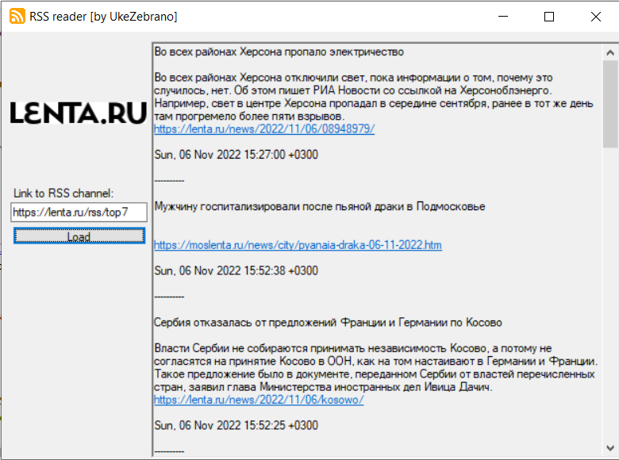

# RSS-reader
Simple RSS reader created with C# (Windows Forms)

**Prewiev:**

**Description**

This program uses recursively building tree elements and displaying them on the screen. All you need is to place RSS channel link into the text box and then push the button *Load*.